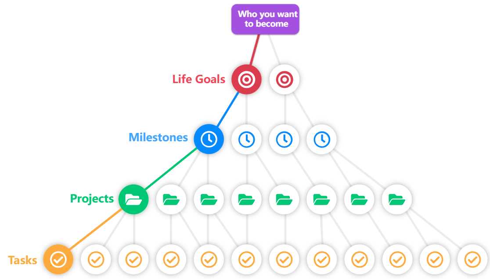

[TOC]

# 《成为你自己》

拓展必看：

- [成为你自己详解版](BecauseYourSelf.md)
- [人生理想与目标思维导图](人生理想与目标.xmind)

## 1、为什么人生目标很重要?

书写格式正确的书面目标为什么如此重要

- 决策疲劳

  <mark>我们是人。我们被编程为采取简单的选择。走阻力最小的路。只有我们清晰地知道自己想要什么，才有动力选择更难走的路。</mark>
  <mark>如果你的目标明确，决策疲劳就会减少，你的选择也会变得更容易。</mark>更容易而不是容易:(

- 衡量(进度)/动机

  衡量你的进步和你花在目标上的时间，是不断提醒你对自己做出的承诺

## 2、人生目标的类型

请记住，是你选择了什么，而不是你没有选择的东西，让你在生活中快乐。

### 目标类型分类

- 成果目标：做出实实在在的成果
- 过程目标：每天专注完成的任务习惯
- 性能目标：个人标准
- 主题目标：专注于某个领域的目标
- 时间目标：有DeadLine的目标

### 人生目标分类

- 健康目标：每周固定的练习时间
- 财务目标：获得一个稳定/舒适的财务状况
- 关系目标：维系家庭和朋友关系可能是最简单的方法，以戏剧性地改善你的生活和你的整体幸福感。
- 教育目标：终身学习者的心态
- 个人发展目标：成为更优秀的你
- 职业目标：确定一个明确的职业目标
- 心理目标：适当地放空自己，有规律地休息或活动给自己减压
- 生活方式目标：休闲目标、爱好/朋友很重要
- 退休目标：仔细想想你的退休目标是什么

## 3、如何设定目标

不管你使用什么技巧，记住，如果目标没有写下来，你就没有目标。同时，记住要为你的目标设定激励。**如果你的目标不能激发行动，那么它们对你就没有用处。**

### 目标设定方法/技术/框架

- **每个类别一个目标技巧**

  浏览第二章的分类列表，绞尽脑汁，直到你能为每个分类想出一个目标。

- **价值观优先技巧**

  一旦你有了这个列表，你就有了一个透镜来审视你的生活。你可以问问自己，那些看重 x 的人会做什么？他们如何与人交流？

- **目的第一技巧**

  如果你已经知道你的人生目标是什么，那么通过目标的透镜来审视你生活的方方面面，设定有效的目标是极其容易的。

- **Why，What，How技巧**

  如果你还没有看过，你真的应该看看西蒙 · 西尼克的 TED 演讲，名为**“从为什么开始”**。

  *Notes：想象一下雇主为什么非要雇佣你不可，你有什么不可替代的吸引力*

- **SMART Goals 明智的目标**

  - Specific 具体点
  - Measurable 可测量的
  - Attainable 可以实现
  - Relevant 相关的
  - Time-bound 有时限的

  **SMART 目标描述了一个完善的目标的剖析。**

- **讣告技巧**

  讣告方法给了你一个很好的方式去思考你想要什么样的目标，而不仅仅是如何写目标(比如 SMART 目标)。

## 4、生活目标的例子

- 财务目标例子

  **在未来5年内每年赚取 $x $000美元**

- 教育目标实例

  - **我将每年至少做 x 个网络课程变成我的爱好。只有有趣的事情**
  - **在接下来的两年里，我将学习如何把 x 说成一个测试级别的 x**

- 个人发展目标的例子

  - 我将致力于我的时间管理和承诺。我会更频繁地对新事物说不，以保证我能够兑现我已经许下的诺言
  - 我会更认真地对待个人责任。我不会因为我对结果有部分影响的事件而责怪他人

- 关系目标例子

  我会每周至少联系我所有亲近的家人一次，看看他们过得怎么样

- 职业目标的例子

  - **我将有勇气改变我的职业生涯。永远不会太迟。我现在将采取渐进的步骤，目标是在未来24个月内进入这个行业**
  - 我将在未来3年内开始我自己的事业，在一个行业，我喜欢和发现迷人

- 心理目标的例子

  **我会每天冥想10分钟，写日记，这样我总是能够自我意识到是什么导致了我内心的挣扎和痛苦**

- 生活方式目标的例子

  - 成为比我年轻的人的榜样，在那里指导他们，帮助他们成长
  - **我将在未来5年内自行出版一本书。如果我能让100个人读我的作品，我会很高兴，也会很满足**

## 5、人生目标语录

- **一个正确设定的目标已经实现了一半**
- **设定目标是将无形变为有形的第一步**
- **在没有明确目标的情况下，我们会变得奇怪地忠于每天做一些琐碎的事情**
- **一个目标并不总是意味着要达到，它通常只是告诉我们目的地**
- **当目标明显无法实现时，不要调整目标，调整行动步骤**
- **目标是一个有最后期限的梦想**
- **目标是强大的动力，但它们也会让你痛苦。你需要一流的日常习惯**

最后一句话很好地开启了下一章。在这篇文章中，我们将讨论长期坚持目标的策略，以及如何让自己对自己负责。

## 6、如何坚持你的目标

- 每周/每月/每季度和每年的回顾

  星期天是我的复习日。我重新阅读了我所有的目标，以及当我决定这些目标对我很重要的时候，我所写的关于它们的内容。

  如果没有这种有规律的强化，你的目标就会半途而废。你需要评估你的进展，并决定在接下来的一周里需要做些什么。

  我知道这一切听起来像“工作”。没错。它应该是。自尊和实现你的目标是工作。

  **你不会后悔每周花15分钟来反思你人生中最重要的愿望。**

- 我应该有多少个目标？

  应该在3到5之间。你需要能够记住它们，并把它们放在首位。

- **里程碑的力量**

  里程碑可以被认为是子目标，但它们可以更容易地使用 SMART 目标格式编写。

- **奖励自己的进步**

  如果你真的达到了一个里程碑，庆祝吧！这是一个了不起的成就，你立即进入前5% 的人。

- 实现人生目标

## 7、使用讣告技巧确定人生目标

1. 描述你想成为什么样的人。用你的讣告作为框架来表达你自己。

   发现你的人生目的和目标，你要做的第一件事就是写你的讣告。

2. 为生活的不同方面创建四个人生目标

3. 对于每个目标，你都要思考你想要它的原因

   如果你实现了这个目标，它将如何影响你的生活？

4. 思考如果目标失败了的话你的生活是怎样的？

   你对自己的情绪和失败的感觉越清楚，你成功的动力就越强大。

5. 从今天开始的十二个月内，你将设定一个S.M.A.R.T. 里程碑，它将成为你实现目标的垫脚石。

   你需要设定一个时间点，在这个时间点上你可以检查你的进度，从而鼓励你今天就采取行动。

